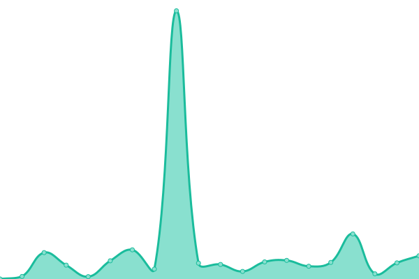

# [📈 Live Status](https://demo.upptime.js.org): <!--live status--> **🟩 All systems operational**

This repository contains the open-source uptime monitor and status page for [Darespider](https://demo.upptime.js.org), powered by [Upptime](https://github.com/upptime/upptime).

With [Upptime](https://upptime.js.org), you can get your own unlimited and free uptime monitor and status page, powered entirely by a GitHub repository. We use [Issues](https://github.com/Darespider/upptime/issues) as incident reports, [Actions](https://github.com/Darespider/upptime/actions) as uptime monitors, and [Pages](https://demo.upptime.js.org) for the status page.

<!--start: status pages-->
<!-- This summary is generated by Upptime (https://github.com/upptime/upptime) -->
<!-- Do not edit this manually, your changes will be overwritten -->
<!-- prettier-ignore -->
| URL | Status | History | Response Time | Uptime |
| --- | ------ | ------- | ------------- | ------ |
|  [Glances](https://glances.darespider.family) | 🟩 Up | [glances.yml](https://github.com/darespider/uptime/commits/HEAD/history/glances.yml) | 

 643ms
     
 | 

<a href="https://uptime.darespider.family/history/glances">100.00%</a>
    

|  [Raspberry PI Monitor](https://rpi.darespider.family) | 🟩 Up | [raspberry-pi-monitor.yml](https://github.com/darespider/uptime/commits/HEAD/history/raspberry-pi-monitor.yml) | 

 427ms
     
 | 

<a href="https://uptime.darespider.family/history/raspberry-pi-monitor">100.00%</a>
    

|  [Homer](https://homer.darespider.family) | 🟩 Up | [homer.yml](https://github.com/darespider/uptime/commits/HEAD/history/homer.yml) | 

 417ms
     
 | 

<a href="https://uptime.darespider.family/history/homer">100.00%</a>
    

|  [Jellyfin](https://jellyfin.darespider.family) | 🟩 Up | [jellyfin.yml](https://github.com/darespider/uptime/commits/HEAD/history/jellyfin.yml) | 

 541ms
     
 | 

<a href="https://uptime.darespider.family/history/jellyfin">100.00%</a>
    

|  [Kavita](https://kavita.darespider.family) | 🟩 Up | [kavita.yml](https://github.com/darespider/uptime/commits/HEAD/history/kavita.yml) | 

 462ms
     
 | 

<a href="https://uptime.darespider.family/history/kavita">100.00%</a>
    

|  [Komga](https://komga.darespider.family) | 🟩 Up | [komga.yml](https://github.com/darespider/uptime/commits/HEAD/history/komga.yml) | 

 331ms
     
 | 

<a href="https://uptime.darespider.family/history/komga">100.00%</a>
    

|  [Portainer](https://portainer.darespider.family) | 🟩 Up | [portainer.yml](https://github.com/darespider/uptime/commits/HEAD/history/portainer.yml) | 

 364ms
     
 | 

<a href="https://uptime.darespider.family/history/portainer">100.00%</a>
    

|  [Pyload](https://pyload.darespider.family) | 🟩 Up | [pyload.yml](https://github.com/darespider/uptime/commits/HEAD/history/pyload.yml) | 

 481ms
     
 | 

<a href="https://uptime.darespider.family/history/pyload">100.00%</a>
    

|  [Transmission](https://transmission.darespider.family) | 🟩 Up | [transmission.yml](https://github.com/darespider/uptime/commits/HEAD/history/transmission.yml) | 

 509ms
     
 | 

<a href="https://uptime.darespider.family/history/transmission">100.00%</a>
    

|  [Vaultwarden](https://vaultwarden.darespider.family) | 🟩 Up | [vaultwarden.yml](https://github.com/darespider/uptime/commits/HEAD/history/vaultwarden.yml) | 

 354ms
     
 | 

<a href="https://uptime.darespider.family/history/vaultwarden">100.00%</a>
    

|  [Syncthing](https://syncthing.darespider.family) | 🟩 Up | [syncthing.yml](https://github.com/darespider/uptime/commits/HEAD/history/syncthing.yml) | 

 459ms
     
 | 

<a href="https://uptime.darespider.family/history/syncthing">0.01%</a>
    

<!--end: status pages-->

[**Visit our status website →**](https://demo.upptime.js.org)

## 📄 License

- Powered by: [Upptime](https://github.com/upptime/upptime)
- Code: [MIT](./LICENSE) © [Darespider](https://demo.upptime.js.org)
- Data in the `./history` directory: [Open Database License](https://opendatacommons.org/licenses/odbl/1-0/)
