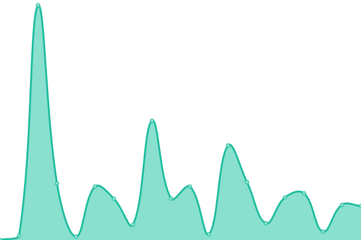
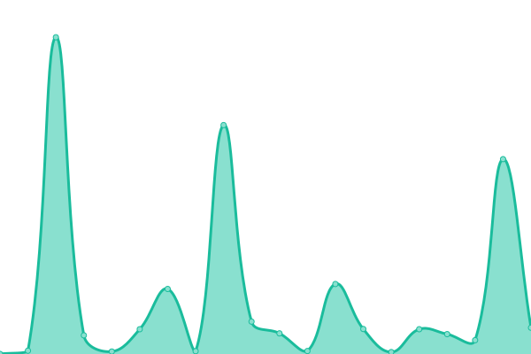

# [📈 Live Status](https://demo.upptime.js.org): <!--live status--> **🟩 All systems operational**

This repository contains the open-source uptime monitor and status page for [Darespider](https://demo.upptime.js.org), powered by [Upptime](https://github.com/upptime/upptime).

With [Upptime](https://upptime.js.org), you can get your own unlimited and free uptime monitor and status page, powered entirely by a GitHub repository. We use [Issues](https://github.com/Darespider/upptime/issues) as incident reports, [Actions](https://github.com/Darespider/upptime/actions) as uptime monitors, and [Pages](https://demo.upptime.js.org) for the status page.

<!--start: status pages-->
<!-- This summary is generated by Upptime (https://github.com/upptime/upptime) -->
<!-- Do not edit this manually, your changes will be overwritten -->
<!-- prettier-ignore -->
| URL | Status | History | Response Time | Uptime |
| --- | ------ | ------- | ------------- | ------ |
|  [Glances](https://glances.darespider.family) | 🟩 Up | [glances.yml](https://github.com/darespider/uptime/commits/HEAD/history/glances.yml) | 

 886ms
     
 | 

<a href="https://uptime.darespider.family/history/glances">100.00%</a>
    

|  [Raspberry PI Monitor](https://rpi.darespider.family) | 🟩 Up | [raspberry-pi-monitor.yml](https://github.com/darespider/uptime/commits/HEAD/history/raspberry-pi-monitor.yml) | 

 555ms
     
 | 

<a href="https://uptime.darespider.family/history/raspberry-pi-monitor">100.00%</a>
    

|  [Home](https://darespider.family) | 🟩 Up | [home.yml](https://github.com/darespider/uptime/commits/HEAD/history/home.yml) | 

 436ms
     
 | 

<a href="https://uptime.darespider.family/history/home">100.00%</a>
    

|  [Portainer](https://portainer.darespider.family) | 🟩 Up | [portainer.yml](https://github.com/darespider/uptime/commits/HEAD/history/portainer.yml) | 

 1526ms
     
 | 

<a href="https://uptime.darespider.family/history/portainer">89.55%</a>
    

|  [Authentik](https://auth.darespider.family) | 🟩 Up | [authentik.yml](https://github.com/darespider/uptime/commits/HEAD/history/authentik.yml) | 

 2663ms
     
 | 

<a href="https://uptime.darespider.family/history/authentik">89.38%</a>
    

|  [Komga](https://komga.darespider.family) | 🟩 Up | [komga.yml](https://github.com/darespider/uptime/commits/HEAD/history/komga.yml) | 

 1082ms
     
 | 

<a href="https://uptime.darespider.family/history/komga">89.20%</a>
    

|  [Kavita](https://kavita.darespider.family) | 🟩 Up | [kavita.yml](https://github.com/darespider/uptime/commits/HEAD/history/kavita.yml) | 

 701ms
     
 | 

<a href="https://uptime.darespider.family/history/kavita">89.16%</a>
    

|  [Jellyfin](https://jellyfin.darespider.family) | 🟩 Up | [jellyfin.yml](https://github.com/darespider/uptime/commits/HEAD/history/jellyfin.yml) | 

 994ms
     
 | 

<a href="https://uptime.darespider.family/history/jellyfin">89.16%</a>
    

|  [Jellyseerr](https://jellyseerr.darespider.family) | 🟩 Up | [jellyseerr.yml](https://github.com/darespider/uptime/commits/HEAD/history/jellyseerr.yml) | 

 1508ms
     
 | 

<a href="https://uptime.darespider.family/history/jellyseerr">89.15%</a>
    

|  [Vaultwarden](https://vaultwarden.darespider.family) | 🟩 Up | [vaultwarden.yml](https://github.com/darespider/uptime/commits/HEAD/history/vaultwarden.yml) | 

 406ms
     
 | 

<a href="https://uptime.darespider.family/history/vaultwarden">89.24%</a>
    

|  [Nextcloud](https://nextcloud.darespider.family) | 🟩 Up | [nextcloud.yml](https://github.com/darespider/uptime/commits/HEAD/history/nextcloud.yml) | 

 1880ms
     
 | 

<a href="https://uptime.darespider.family/history/nextcloud">89.16%</a>
    

|  [Syncthing](https://syncthing.darespider.family) | 🟩 Up | [syncthing.yml](https://github.com/darespider/uptime/commits/HEAD/history/syncthing.yml) | 

 846ms
     
 | 

<a href="https://uptime.darespider.family/history/syncthing">89.33%</a>
    

|  [Pyload](https://pyload.darespider.family) | 🟩 Up | [pyload.yml](https://github.com/darespider/uptime/commits/HEAD/history/pyload.yml) | 

 889ms
     
 | 

<a href="https://uptime.darespider.family/history/pyload">89.32%</a>
    

|  [Transmission](https://transmission.darespider.family) | 🟩 Up | [transmission.yml](https://github.com/darespider/uptime/commits/HEAD/history/transmission.yml) | 

 492ms
     
 | 

<a href="https://uptime.darespider.family/history/transmission">100.00%</a>
    

|  [Radarr](https://radarr.darespider.family) | 🟩 Up | [radarr.yml](https://github.com/darespider/uptime/commits/HEAD/history/radarr.yml) | 

 361ms
     
 | 

<a href="https://uptime.darespider.family/history/radarr">100.00%</a>
    

|  [Sonarr](https://sonarr.darespider.family) | 🟩 Up | [sonarr.yml](https://github.com/darespider/uptime/commits/HEAD/history/sonarr.yml) | 

 288ms
     
 | 

<a href="https://uptime.darespider.family/history/sonarr">100.00%</a>
    

|  [Bazarr](https://bazarr.darespider.family) | 🟩 Up | [bazarr.yml](https://github.com/darespider/uptime/commits/HEAD/history/bazarr.yml) | 

 359ms
     
 | 

<a href="https://uptime.darespider.family/history/bazarr">100.00%</a>
    

|  [Prowlarr](https://prowlarr.darespider.family) | 🟩 Up | [prowlarr.yml](https://github.com/darespider/uptime/commits/HEAD/history/prowlarr.yml) | 

 419ms
     
 | 

<a href="https://uptime.darespider.family/history/prowlarr">100.00%</a>
    

|  [Mylar3](https://mylar.darespider.family) | 🟩 Up | [mylar3.yml](https://github.com/darespider/uptime/commits/HEAD/history/mylar3.yml) | 

 1018ms
     
 | 

<a href="https://uptime.darespider.family/history/mylar3">89.32%</a>
    

<!--end: status pages-->

[**Visit our status website →**](https://demo.upptime.js.org)

## 📄 License

- Powered by: [Upptime](https://github.com/upptime/upptime)
- Code: [MIT](./LICENSE) © [Darespider](https://demo.upptime.js.org)
- Data in the `./history` directory: [Open Database License](https://opendatacommons.org/licenses/odbl/1-0/)
